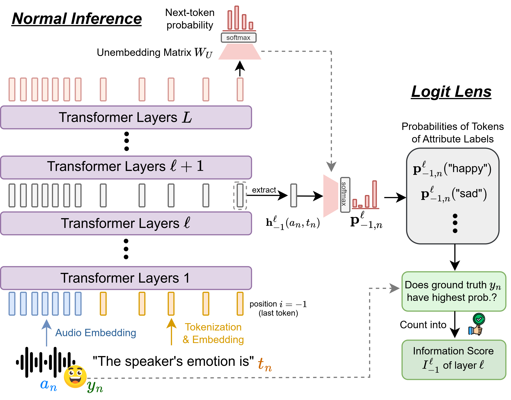

# 🔬 AudioLens: A Closer Look at Auditory Attribute Perception of Large Audio-Language Models

### The official GitHub page of the paper "AudioLens: A Closer Look at Auditory Attribute Perception of Large Audio-Language Models"
- Authors: [Chih-Kai Yang](https://www.linkedin.com/in/chih-kai-yang-82201a221/), Neo S. Ho, Yi-Jyun Lee, Hung-yi Lee
- Affiliation: National Taiwan University
- Accepted to **ASRU 2025**
- Paper link: https://arxiv.org/abs/2506.05140

## 📢 News

- [2025/08/11] Our [paper](https://arxiv.org/abs/2506.05140) is accepted to ASRU 2025! See you in Hawaii!

## 📚 Abstract

**TL;DR: we investigate how information about auditory attributes (e.g., speaker gender, emotion) evolves inside large audio-language models (LALMs).**

Understanding the internal mechanisms of large audio-language models (LALMs) is crucial for interpreting their behavior and improving performance. This work presents the first in-depth analysis of how LALMs internally perceive and recognize auditory attributes. By applying vocabulary projection on three state-of-the-art LALMs, we track how attribute information evolves across layers and token positions. We find that attribute information generally decreases with layer depth when recognition fails, and that resolving attributes at earlier layers correlates with better accuracy. Moreover, LALMs heavily rely on querying auditory inputs for predicting attributes instead of aggregating necessary information in hidden states at attribute-mentioning positions. Based on our findings, we demonstrate a method to enhance LALMs. Our results offer insights into auditory attribute processing, paving the way for future improvements.

## 🔎 Key Findings
- Two contrasting internal trends emerge in LALMs, shaping the correctness of attribute recognition.

- Recognition accuracy strongly correlates with the layers where attribute information is resolved.

- Attribute-mentioning tokens fail to adequately consolidate relevant information, and LALMs still rely heavily on auditory inputs, potentially limiting their ability to perform more complex reasoning.

- Building on these insights, we propose a preliminary method to enhance auditory attribute recognition in LALMs.


## ✒️ Methods

We adopt the Logit Lens techniques to study the internal information evolution of LALMs.

<div style="text-align: center;">
  <div style="display: flex; align-items: center; justify-content: center;">
    
  </div>
</div>

## 🔧 Usages

### Environments

Install the environement:

```
pip install -r requirements.txt
```

### Datasets

Download the SAKURA benchmark from [the official HuggingFace link](https://huggingface.co/SLLM-multi-hop).


### Run Logit Lens on DeSTA2!

```
cd patchscopes/code
python run_logit_lens.py [with some arguments depending on the use case]
```

Codes for other models will be released soon!

## 🔖 Citation

If you find our paper helpful, please consider to cite our paper:
```
@article{yang2025audiolens,
  title={AudioLens: A Closer Look at Auditory Attribute Perception of Large Audio-Language Models},
  author={Yang, Chih-Kai and Ho, Neo and Lee, Yi-Jyun and Lee, Hung-yi},
  journal={arXiv preprint arXiv:2506.05140},
  year={2025}
}
```

## Credits

This project is based on the code released with "[Patchscopes: A Unifying Framework for Inspecting
Hidden Representations of Language Models](https://arxiv.org/abs/2401.06102)".  
We have modified and extended the original repository to support our experiments and analyses.  
We thank the authors for making their implementation publicly available.


